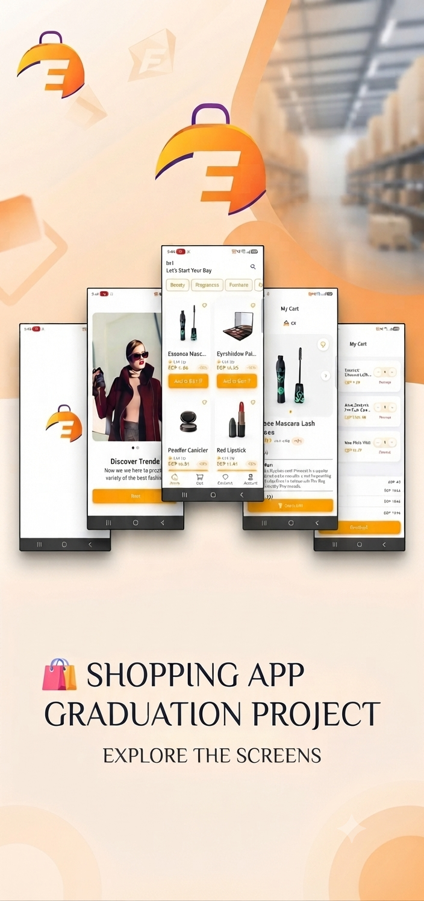

# 🛍️ Shopping App 

<div align="center">
  
</div>

A production-grade **Flutter Shopping application** built with **Clean Architecture**, **Bloc state management**, and a **RESTful supermarket API**. Features full authentication, product browsing, search, a persistent cart with EGP pricing, favourites, and a complete user profile.

[](https://flutter.dev)
[](https://dart.dev)
[](https://bloclibrary.dev)
[](https://blog.cleancoder.com/uncle-bob/2012/08/13/the-clean-architecture.html)
[](LICENSE)

---

## 📋 Table of Contents

- [✨ Features](#-features)
- [🛠️ Tech Stack](#-tech-stack)
- [🏗️ Architecture](#️-architecture)
- [📂 Project Structure](#-project-structure)
- [🚀 Getting Started](#-getting-started)
- [🌐 API Reference](#-api-reference)
- [📱 Screens & Flow](#-screens--flow)
- [🧠 How It Works](#-how-it-works)
- [🎨 Design System](#-design-system)
- [🛣️ Roadmap](#-roadmap)
- [🤝 Contributing](#-contributing)
- [📄 License](#-license)

---

## ✨ Features

### 🎬 Onboarding & Welcome
- ✅ **3-step onboarding** with animated transitions & smooth page indicator
- ✅ **Skip** option to jump straight into the app
- ✅ **Welcome ("Hello") screen** with animated greeting & Lottie illustrations
- ✅ **Smart launcher** that routes new vs. returning users

### 🔐 Authentication
- ✅ **Full user registration** — name, email, password & avatar
- ✅ **Secure login** with JWT-based authentication
- ✅ **Password reset** flow (reset code → activate → new password)
- ✅ **Token persistence** via `SharedPreferences` + secure storage
- ✅ **Auto session restore** — logged-in users skip auth screen
- ✅ **Form validation** with friendly error messages

### 🏠 Home & Products
- ✅ **Live product feed** from the REST API
- ✅ **Infinite scroll** — paginated loading (10 per page)
- ✅ **Category chips** for quick filtering
- ✅ **Search by category** with real-time query results
- ✅ **Product cards** with image, title, price & favourite toggle
- ✅ **Skeleton shimmer loading** for a smooth UX

### 🗂️ Categories
- ✅ **Browse products by category** with dedicated routes
- ✅ **Category filtering** on the search screen
- ✅ **Dynamic product grids** per category

### 🛒 Shopping Cart
- ✅ **Add / remove / update** item quantities
- ✅ **Live cart badge** (99+ handling) on the bottom nav
- ✅ **Persistent cart** synced with the backend
- ✅ **EGP pricing** with subtotal, shipping fee & total breakdown
- ✅ **Checkout** with a success confirmation dialog
- ✅ **Empty cart state** with engaging illustration

### ❤️ Favourites
- ✅ **Add / remove favourites** with instant UI feedback
- ✅ **Favourite status** synced across Home, Product Details & list
- ✅ **Dedicated Favourites screen**

### 👤 Account
- ✅ **User profile** display (avatar, name, email)
- ✅ **Edit user data** & **upload profile image**
- ✅ **Account management** integrated with the backend

### 🧩 Robust UX Infrastructure
- ✅ **Unified state handling** (Loading / Success / Error) via `BaseState`
- ✅ **Error handling screens** — 404, network errors & under-maintenance
- ✅ **Lottie animations** for loading, searching & empty states
- ✅ **Reusable components** — buttons, cards, shimmer, error widgets
- ✅ **Portrait-only** orientation lock for a focused mobile experience

---

## 🛠️ Tech Stack

| Layer | Technology | Purpose |
|-------|------------|---------|
| **Frontend** | [Flutter](https://flutter.dev) | Cross-platform UI framework |
| **Language** | [Dart](https://dart.dev) | Programming language |
| **Architecture** | Clean Architecture | Data / Domain / Presentation separation |
| **State Management** | [Flutter Bloc](https://bloclibrary.dev) | Reactive state management (Cubit/Bloc) |
| **DI** | [get_it](https://pub.dev/packages/get_it) + [injectable](https://pub.dev/packages/injectable) | Dependency injection & service locator |
| **Networking** | [Dio](https://pub.dev/packages/dio) | HTTP client with interceptors |
| **Serialization** | json_annotation + json_serializable | Type-safe JSON models |
| **Storage** | `shared_preferences` | Local token & cache persistence |
| **Images** | `cached_network_image` | Efficient image caching |
| **Animations** | `animate_do`, `lottie`, `shimmer` | Micro-interactions & loading states |
| **UI Extras** | `carousel_slider`, `flutter_slidable`, `smooth_page_indicator` | Product gallery, swipe actions, onboarding |

---

## 🏗️ Architecture

The app follows a **feature-first Clean Architecture**, separating each feature into three layers:

### 🔻 Data Layer
- **Models** — JSON-serializable DTOs (`*.g.dart`)
- **Data Sources** — API calls & remote fetching
- **Repositories implementation** — implements the domain interfaces

### 🔶 Domain Layer
- **Entities** — pure business objects
- **Repository interfaces** — contracts for data access
- **Use Cases** — single-responsibility business actions

### 🖥️ Presentation Layer
- **Screens / Views** — UI widgets
- **View Models** — Cubits / Blocs handling state & events
- **Widgets** — reusable UI components

---

## 🚀 Getting Started

### 📋 Prerequisites

- [Flutter SDK](https://docs.flutter.dev/get-started/install) (3.24+)
- [Dart SDK](https://dart.dev/get-dart) (3.12+)
- An active internet connection (the app uses a live REST API)

### 🛠️ Installation

```bash
# 1. Clone the repository
git clone [https://github.com/kerols-Gamal0/shopping_app.git](https://github.com/kerols-Gamal0/shopping_app.git)
cd shopping_app

# 2. Fetch dependencies
flutter pub get

# 3. Generate code (models & DI) — needed after cloning
dart run build_runner build --delete-conflicting-outputs

# 4. Run the app
flutter run
